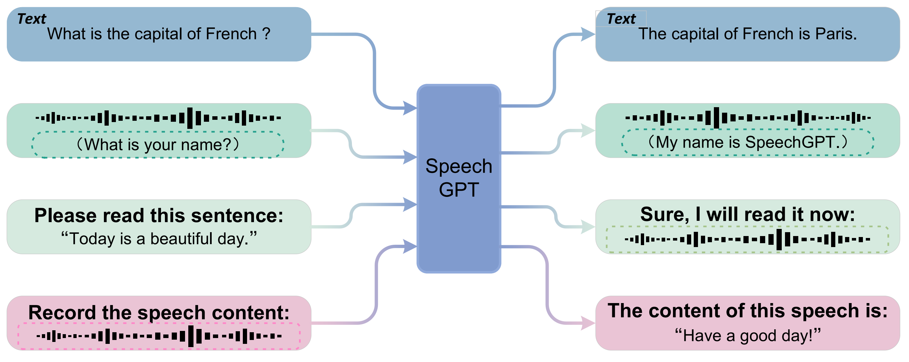
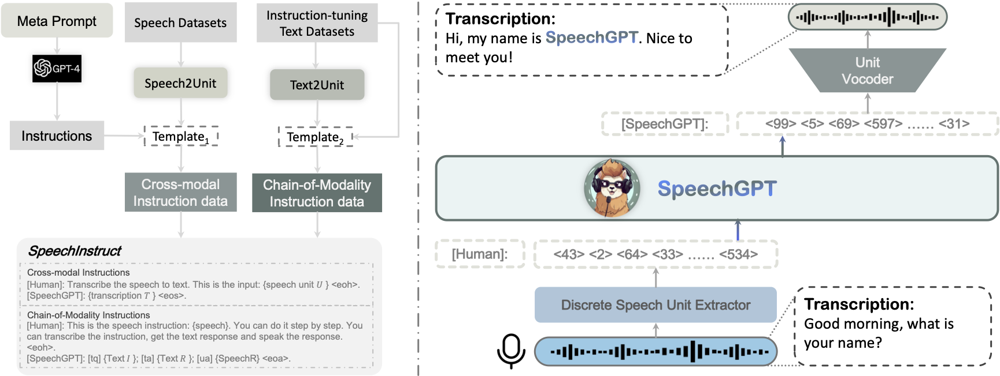
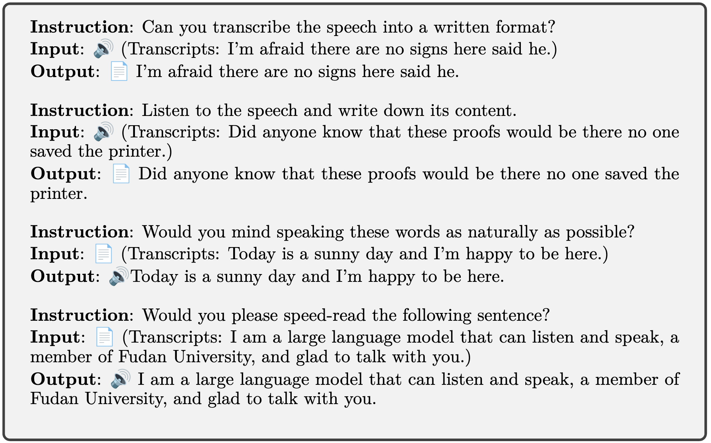

# SpeechGPT: Empowering Large Language Models with Intrinsic Cross-Modal Conversational Abilities

<!-- [[Project Page](https://0nutation.github.io/SpeechGPT.github.io/)] [[Paper]()] -->

  

      

## Introduction
SpeechGPT is a large language model with **intrinsic cross-modal conversational abilities**, capable of perceiving and generating multi-model content following human instructions. With discrete speech representations, we first construct **SpeechInstruct**, a large-scale cross-modal speech instruction dataset. Additionally, we employ a three-stage training strategy that includes **modality-adaptation pre-training**, **cross-modal instruction fine-tuning**, and **chain-of-modality instruction fine-tuning**. The experimental results demonstrate that SpeechGPT has an impressive capacity to follow multi-modal human instructions and highlight the potential of handling multiple modalities with one model.  
SpeechGPT demos are shown in our [project page](https://0nutation.github.io/SpeechGPT.github.io/). As shown in the demos, SpeechGPT has strong cross-modal instruction-following ability and spoken dialogue ability. SpeechGPT can be **a talking encyclopedia, your personal assistant, your chat partner, a poet, a psychologist and your educational assistant**...

 
 

      
    SpeechGPT’s capabilities to tackle multiple cross-modal tasks

 
 

      
    Left: SpeechInstruct construction process.  Right: SpeechGPT model structure

## Release
- [5/18] 🔥 We released **SpeechGPT: Empowering Large Language Models with Intrinsic Cross-Modal Conversational Abilities**. We propose SpeechGPT, the first multi-modal LLM capable of perceiving and generating multi-modal contents following multi-modal human instructions.  Checkout the [paper]() and [demo](https://0nutation.github.io/SpeechGPT.github.io/).

## Contents
- [Dataset](#dataset)
- [Models](#models)
- [Talk with SpeechGPT](#talk-with-speechgpt)
- [Fine-tune SpeechGPT](#fine-tune-speechgpt)
- [Performance](#performance)

## Dataset
We will release SpeechInstruct dataset.
## Models
## Talk with SpeechGPT
## Fine-tune SpeechGPT
## Performance
SpeechGPT demos are shown in our [project page](https://0nutation.github.io/SpeechGPT.github.io/). As shown in the demos, SpeechGPT has strong cross-modal instruction-following ability and spoken dialogue ability. SpeechGPT can be a talking encyclopedia, your personal assistant, your chat partner, a poet, a psychologist andd your educational assistant etc.
 
 

      
    Cases of cross-modal instruction-following results

 
 

      
    Cases of spoken dialogue results

