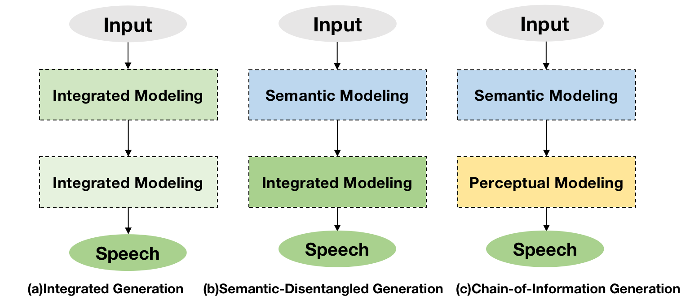
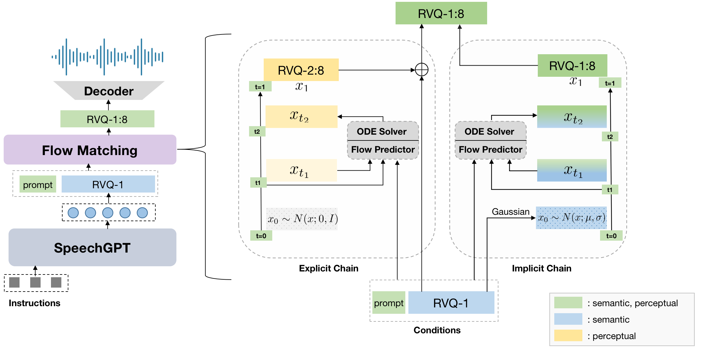

# SpeechGPT-Gen: Scaling Chain-of-Information Speech Generation

   

      

## Introduction
Current large-scale speech generative models have demonstrated remarkable in-context speech generation abilities, generalizing effectively to to unseen speakers. 
However, from the information modeling perspective, certain redundancies exist in their modeling process.
We introduce Chain-of-Information Generation, a semantic and perceptual disentangled approach to
large-scale speech generation, which performs semantic and perceptual modeling sequentially. Based on that, we build SpeechGPT-Gen, a large speech langauge model with strong semantic and perceptual modeling abilities. SpeechGPT-Gen consists of a LLM based autoregressive model for semantic modeling and a flow matching based non-autoregressive model for perceptual modeling. We propose to improve the efficiency of flow matching by injecting semantic information into the prior distribution.
Scaling up the model parameters to 8 billion, SpeechGPT-Gen achieves impressive performance on zero-shot text-to-speech, zero-shot voice conversion and
speech-to-speech dialogue, showing strong semantic and perceptual modeling capabilities and the effectiveness
and efficiency of Chain-of-Information Generation method.

      
    Illustration of SpeechGPT-Gen.

## Code 
We will soon open-source our codes and models, stay tuned!

## Citation
