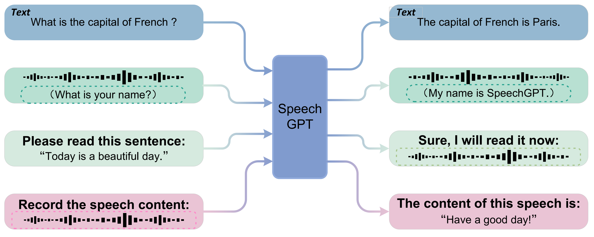
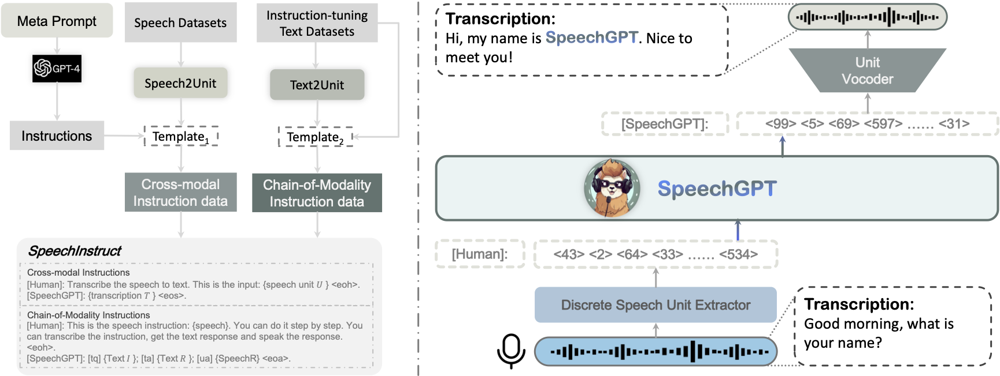

# SpeechGPT: Empowering Large Language Models with Intrinsic Cross-Modal Conversational Abilities

<a href='https://0nutation.github.io/SpeechGPT.github.io/'></a>  <a href='https://arxiv.org/abs/2305.11000'></a> [](https://huggingface.co/datasets/fnlp/SpeechInstruct)

<p align="center">
     <br>
</p>

## Introduction
SpeechGPT is a large language model with **intrinsic cross-modal conversational abilities**, capable of perceiving and generating multi-model content following human instructions. With discrete speech representations, we first construct **SpeechInstruct**, a large-scale cross-modal speech instruction dataset. Additionally, we employ a three-stage training strategy that includes **modality-adaptation pre-training**, **cross-modal instruction fine-tuning**, and **chain-of-modality instruction fine-tuning**. The experimental results demonstrate that SpeechGPT has an impressive capacity to follow multi-modal human instructions and highlight the potential of handling multiple modalities with one model. <br>
SpeechGPT demos are shown in our [project page](https://0nutation.github.io/SpeechGPT.github.io/). As shown in the demos, SpeechGPT has strong cross-modal instruction-following ability and spoken dialogue ability. SpeechGPT can be **a talking encyclopedia, your personal assistant, your chat partner, a poet, a psychologist and your educational assistant**...

<br>
<br>
<p align="center">
     <br>
    SpeechGPT’s capabilities to tackle multiple cross-modal tasks
</p>
<br>
<br>
<p align="center">
     <br>
    Left: SpeechInstruct construction process.  Right: SpeechGPT model structure
</p>


## Table of Contents
- [Open-source list](#open-source-list)
- [Talk with SpeechGPT](#talk-with-speechgpt)
- [Train SpeechGPT](#train-speechgpt)
- [Finetune SpeechGPT](#finetune-speechgpt)


## Open-source list
### Models

- [**SpeechGPT-7B-ma**](https://huggingface.co/fnlp/SpeechGPT-7B-ma): The model obtained after the first-stage modality-adaptation pre-training, which was initialized with LLaMA-7B and further pre-trained on LibriLight speech units.
- [**SpeechGPT-7B-cm**](https://huggingface.co/fnlp/SpeechGPT-7B-cm): The model obtained after the second-stage cross-modal instruction finetuning, which was initialized with SpeechGPT-7B-ma and further finetuned on SpeechInstruct Cross-Modal Instruction set. This is a powerful foundational model that aligns speech and text.
- [**SpeechGPT-7B-com**](https://huggingface.co/fnlp/SpeechGPT-7B-com): The model obtained after the third-stage chain-of-modality instruction lora-finetuning, which was initialized with SpeechGPT-7B-cm and further lora-finetuned on SpeechInstruct Chain-of-Modality Instruction set. This is an adapter-model of SpeechGPT-7B-cm for spoken dialogue.

### Datasets

- [**SpeechInstruct-cross-modal**](https://huggingface.co/datasets/fnlp/SpeechInstruct): The cross-modal instruction set, about 9 million unit-text data pairs tokenized by mHuBERT from large-scale English ASR datasets. data format:
- [**SpeechInstruct-chain-of-modality**](https://huggingface.co/datasets/fnlp/SpeechInstruct): The chain-of-thought style instructions for four input-output formats, namely Speech Instruction-Speech Response, Speech Instruction-Text Response, Text Instruction-Speech Response, and Text Instruction-Text Response.

SpeechInstruct-cross-modal data format:
```
[
    {
        "prefix": "You are an AI assistant whose name is SpeechGPT.\n- SpeechGPT is a intrinsic cross-modal conversational language model that is developed by Fudan University.  SpeechGPT can understand and communicate fluently with human through speech or text chosen by the user.\n- It can perceive cross-modal inputs and generate cross-modal outputs.\n",
        "plain_text": "[Human]: Try to speak out this sentence, please. This is input: The alchemist rode in front, with the falcon on his shoulder.<eoh> [SpeechGPT]: <sosp><661><588><604><157><596><499><596><106><596><189><63><189><665><991><162><202><393><946><327><905><907><597><660><351><557><794><788><59><754><12><977><877><333><873><835><67><940><118><686><613><169><72><644><553><535><935><101><741><384><173><894><787><380><787><196><555><721><944><250><56><812><222><915><143><390><479><330><435><647><246><650><816><325><506><686><208><613><417><755><193><411><452><111><735><6><735><63><665><644><991><535><271><333><196><918><29><202><393><946><734><390><479><330><776><167><761><907><597><660><351><557><794><75><788><15><366><896><627><168><654><659><177><183><609><710><187><493><361><470><821><59><56><198><912><742><840><431><531><76><668><576><803><791><380><660><325><801><549><366><377><164><309><584><605><193><71><39><eosp><eoa> "
    },
]
```

SpeechInstruct-chain-of-modality data format:
```
[
    {
        "prefix": "You are an AI assistant whose name is SpeechGPT.\n- SpeechGPT is a intrinsic cross-modal conversational language model that is developed by Fudan University.  SpeechGPT can understand and communicate fluently with human through speech or text chosen by the user.\n- It can perceive cross-modal inputs and generate cross-modal outputs.\n",
        "plain_text": "[Human]: <sosp><661><987><511><732><951><997><111><982><189><63><665><991><535><101><741><173><945><944><503><641><124><565><734><870><290><978><833><238><761><907><430><901><185><403><557><244><583><788><663><969><896><627><143><515><663><969><660><691><251><412><260><41><740><677><253><380><382><268><506><876><417><755><16><819><80><651><80><651><80><987><588><eosp><eoh>. [SpeechGPT]: What is a bad term for poop?; [ta] A bad term for poop is excrement. It is usually used as a polite way to refer to fecal waste.; [ua] <sosp><497><63><264><644><710><823><565><577><154><331><384><173><945><29><244><326><583><728><576><663><969><896><627><143><38><515><663><24><382><251><676><412><260><41><740><677><253><382><268><876><233><878><609><389><771><865><641><124><878><609><423><384><879><487><219><522><589><337><126><119><663><748><12><671><877><377><385><902><819><619><842><419><997><829><111><666><42><277><63><665><644><389><771><685><437><641><124><258><436><139><340><11><59><518><56><948><86><258><436><139><340><347><376><940><118><944><878><173><641><124><362><734><179><961><931><878><609><423><384><879><219><522><866><337><243><935><101><741><822><89><194><630><86><555><105><79><868><220><156><824><998><870><390><422><330><776><663><969><523><105><79><799><220><357><390><479><422><330><776><485><165><86><501><119><716><205><521><787><935><101><741><89><194><664><835><67><940><118><613><417><755><902><415><772><497><eosp><eoa>."
    },
]
```

## Talk with SpeechGPT
**Due to limited training data and resources, the performance of the open-source SpeechGPT is currently not optimal. Problems such as task recognition errors and inaccuracies in speech recognition may occur. As this project is primarily an exploration in research, we have not increased the amount of pretraining and sft data or training steps to enhance performance. Our hope is that SpeechGPT can serve as a foundational model to encourage research and exploration in the field of speech language models.**

### Installation

```bash
git clone https://github.com/0nutation/SpeechGPT
cd SpeechGPT/speechgpt
conda create --name SpeechGPT python=3.8
conda activate SpeechGPT
pip install -r requirements.txt
```


### Download
To talk with SpeechGPT, you should download [SpeechGPT-7B-cm](https://huggingface.co/fnlp/SpeechGPT-7B-cm) and [SpeechGPT-7B-com](https://huggingface.co/fnlp/SpeechGPT-7B-com) locally.

You should download mHuBERT model to ```utils/speech2unit/```. Please see [Speech2unit](https://github.com/0nutation/SpeechGPT/blob/main/speechgpt/utils/speech2unit/README.md) for details.
```bash
s2u_dir="uitls/speech2unit"
cd ${s2u_dir}
wget https://dl.fbaipublicfiles.com/hubert/mhubert_base_vp_en_es_fr_it3.pt
wget https://dl.fbaipublicfiles.com/hubert/mhubert_base_vp_en_es_fr_it3_L11_km1000.bin
```

You should download the unit-vocoder to ```utils/vocoder/```. Please see [vocoder](https://github.com/0nutation/SpeechGPT/blob/main/speechgpt/utils/vocoder/README.md) for details.
```bash
vocoder_dir="utils/vocoder/"
cd ${vocoder_dir}
wget https://dl.fbaipublicfiles.com/fairseq/speech_to_speech/vocoder/code_hifigan/mhubert_vp_en_es_fr_it3_400k_layer11_km1000_lj/config.json -O config.json
wget https://dl.fbaipublicfiles.com/fairseq/speech_to_speech/vocoder/code_hifigan/mhubert_vp_en_es_fr_it3_400k_layer11_km1000_lj/g_00500000 -O vocoder.pt
```

### CLI Inference
```bash
python3 speechgpt/src/infer/cli_infer.py \
--model-name-or-path "path/to/SpeechGPT-7B-cm" \
--lora-weights "path/to/SpeechGPT-7B-com" \
--s2u-dir "${s2u_dir}" \
--vocoder-dir "${vocoder_dir} \
--output-dir "output" 
```
**Notes:**
For speech input, you can provide the path to the audio file. For ASR or TTS tasks, you must prefix the speech or text with ```this is input: ```,  otherwise, it may be recognized incorrectly.
The speech response will be saved to a ```.wav``` file, and detailed responses will be saved in a JSON file. The paths to these files will be indicated in the response.

Here are some examples of talking with SpeechGPT:

**Textual dialogue example**
```
Please talk with SpeechGPT:
Who is Lebron James?
Response:
   Lebron James is an American professional basketball player for the Los Angeles Lakers of the National Basketball Association (NBA). He is considered one of the greatest basketball players of all time and is known for his athleticism, scoring ability, and leadership skills. He is a four-time NBA MVP, a 14-time NBA All-Star, a 13-time All-NBA selection, and a two-time Olympic gold medalist.
Response json is saved in output/responses.json
```

**Spoken dialogue example**
```
Please talk with SpeechGPT:
prompts/0.wav
Transcript:   What are the main causes of climate change?
Text response:  The main causes of climate change are human activities such as burning fossil fuels, deforestation, and agricultural practices. These activities release greenhouse gases, like carbon dioxide and Methane, into the atmosphere which trap heat and cause the Earth's temperature to rise.
Speech repsonse is saved in output/wav/answer_0.wav
Response json is saved in output/responses.json
```

**ASR example**
```
Please talk with SpeechGPT:
Recognize this speech, this is input: prompts/1.wav
Response:
   today is a sunny day.
Response json is saved in output/responses.json
```

**TTS example**
```
Please talk with SpeechGPT:
Read this sentence aloud, this is input: Today is a sunny day.
Response:
   <sosp> <661> <987> <520> <982> <681> <982> <681> <982> <681> <982> <681> <982> <189> <63> <662> <79> <868> <220> <196> <166> <549> <822> <89> <194> <633> <14> <855> <183> <609> <389> <771> <865> <641> <124> <362> <734> <742> <98> <519> <26> <204> <280> <668> <167> <104> <650> <179> <961> <428> <950> <82> <165> <196> <166> <549> <822> <89> <194> <458> <726> <603> <819> <651> <133> <651> <133> <186> <133> <186> <133> <186> <511> <186> <511> <eosp> 
Speech repsonse is saved in output/wav/answer_1.wav
Response json is saved in output/responses.json
```


### Gradio Web UI
```bash
python3 speechgpt/src/infer/web_infer.py \
--model-name-or-path "path/to/SpeechGPT-7B-cm" \
--lora-weights "path/to/SpeechGPT-7B-com" \
--s2u-dir "${s2u_dir}" \
--vocoder-dir "${vocoder_dir}" \
--output-dir "output/" 
```


## Train SpeechGPT
### Stage1: Modality-adaptation Pre-training
First, utilize mHuBERT for discretizing the LibriLight dataset to obtain discrete unit sequences for stage1 training. You can refer to the data processing methods in [Speech2unit](https://github.com/0nutation/SpeechGPT/blob/main/speechgpt/utils/speech2unit/README.md).

Second, divide the discrete units into a training set and a development set, and save them in the following format in the files ```data/stage1/train.txt``` and ```data/stage1/dev.txt```:
```
<sosp><189><247><922><991><821><258><485><974><284><466><969><523><196><202><881><331><822><853><432><32><742><98><519><26><204><280><576><384><879><901><555><944><366><641><124><362><734><156><824><462><761><907><430><81><597><716><205><521><470><821><677><355><483><641><124><243><290><978><82><620><915><470><821><576><384><466><398><212><455><931><579><969><778><45><914><445><469><576><803><6><803><791><377><506><835><67><940><613><417><755><237><224><452><121><736><eosp>
<sosp><300><189><63><6><665><991><881><331><6><384><879><945><29><244><583><874><655><837><81><627><545><124><337><850><412><213><260><41><740><797><211><488><961><428><6><196><555><944><873><32><683><700><955><812><328><915><166><250><56><903><86><233><479><330><776><167><104><764><259><921><366><663><432><431><531><976><314><822><89><664><377><611><479><417><eosp>
<sosp><189><735><991><39><565><734><32><742><98><519><26><204><280><668><576><803><791><660><555><233><787><101><741><466><969><219><107><459><491><556><384><733><219><501><445><137><910><523><793><50><981><230><534><321><948><86><116><281><62><462><104><70><918><743><15><212><455><143><836><173><944><958><390><422><66><776><258><436><139><663><432><742><98><519><589><243><126><260><41><444><6><655><764><969><219><727><85><297><700><362><493><6><493><361><393><946><6><470><821><246><655><837><81><969><916><584><819><544><452><158><452><736><eosp>
```
Third, you should download LLaMA 7B(HuggingFace) to ```llama/hf/7B```.

Now you can start stage1 training: 
To perform distributed training, you must specify the correct values for ```NNODE```, ```NODE_RANK```, ```MASTER_ADDR```, and ```MASTER_PORT```.
```bash
bash scripts/ma_pretrain.sh ${NNODE} ${NODE_RANK} ${MASTER_ADDR} ${MASTER_PORT} 
```

### Stage 2: Cross-modal Instruction Finetuning
You should download [SpeechInstruct Cross-modal Instruction set](https://huggingface.co/datasets/fnlp/SpeechInstruct/resolve/main/cross_modal_instruction.jsonl) to ```data/stage2/```.

If you want to skip stage1 training, you can download ```SpeechGPT-7B-ma``` to ```output/stage1/```.

Now you can start stage2 training: 
To perform distributed training, you must specify the correct values for ```NNODE```, ```NODE_RANK```, ```MASTER_ADDR```, and ```MASTER_PORT```.
```bash
bash scripts/cm_sft.sh ${NNODE} ${NODE_RANK} ${MASTER_ADDR} ${MASTER_PORT} 
```

### Stage 3: Chain-of-modality Instruction Finetuning
You should download [SpeechInstruct Chain-of-modality Instruction set](https://huggingface.co/datasets/fnlp/SpeechInstruct/resolve/main/chain_of_modality_instruction.jsonl) to ```data/stage3/```.

If you want to skip stage1 and stage2, you can download ```SpeechGPT-7B-cm``` to ```output/stage2/```.

Now you can start stage3 training: 
To perform distributed training, you must specify the correct values for ```NNODE```, ```NODE_RANK```, ```MASTER_ADDR```, and ```MASTER_PORT```.
```bash
bash scripts/com_sft.sh ${NNODE} ${NODE_RANK} ${MASTER_ADDR} ${MASTER_PORT} 
```

## Finetune SpeechGPT
```Speech-7B-cm``` is a foundational model with strong alignment between speech and text. We encourage fine-tuning SpeechGPT based on this model.

Step1: prepare your data following the format in [SpeechInstruct Cross-modal Instruction set](https://huggingface.co/datasets/fnlp/SpeechInstruct/resolve/main/cross_modal_instruction.jsonl).

Step2: download [SpeechGPT-7B-cm](https://huggingface.co/fnlp/SpeechGPT-7B-cm) locally.

Step3: Modify the ```METAROOT```, ```DATAROOT```, and ```OUTROOT``` parameters in the ```scripts/cm_sft.sh``` script to yours and then run it. For LoRA fine-tuning, update the ```METAROOT```, ```DATAROOT```, and ```OUTROOT``` parameters in the ```scripts/com_sft.sh``` script and run it.


## Acknowledgements
- We express our appreciation to Fuliang Weng and Rong Ye for their valuable suggestions and guidance.
- [MOSS](https://github.com/OpenLMLab/MOSS): We use moss-sft-002-data.
- [stanford_alpaca](https://github.com/tatsu-lab/stanford_alpaca):The codebase we built upon.

## Citation
If you find SpeechGPT useful for your research and applications, please cite using the BibTex:

```
@misc{zhang2023speechgpt,
      title={SpeechGPT: Empowering Large Language Models with Intrinsic Cross-Modal Conversational Abilities}, 
      author={Dong Zhang and Shimin Li and Xin Zhang and Jun Zhan and Pengyu Wang and Yaqian Zhou and Xipeng Qiu},
      year={2023},
      eprint={2305.11000},
      archivePrefix={arXiv},
      primaryClass={cs.CL}
}
```
